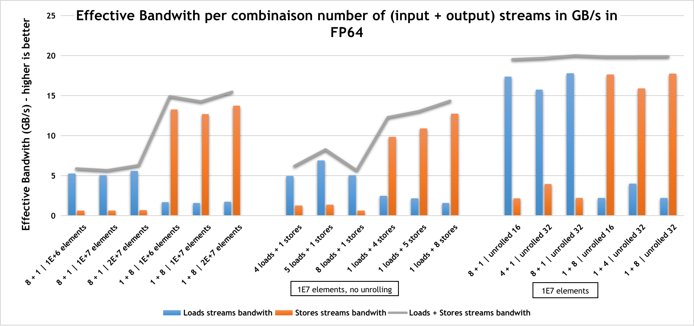

## Load vs Store streams Bandwith Comparison

> We expected the store streams to be "faster to be processed" than load ones. We conducted the following experiment :
> - One code with multiple load streams from FPGA DRAM and 1 store stream
> - One code with 1 load stream from FPGA DRAM and multiple store streams

Code structure is as follows : 

Example code structure for 4 loads, 1 store streams
```cpp
void launcher_loads(T *d1, T *d2, T *d3, T *d4, T *d_res, size_t N, sycl::queue queue)
{
    queue.submit([&](sycl::handler &h) {
        h.single_task([=]() [[intel::kernel_args_restrict]] {

            for (size_t i = 0; i < N; ++i) {
                T x1 = d1[i];
                T x2 = d2[i];
                T x3 = d3[i];
                T x4 = d4[i];
                d_res[i] = x1 + x2 + x3 + x4;
            }

        });
    });
}
```

Example code structure for 4 stores.
```cpp
void launcher_stores4(T *d_input, T *d1, T *d2, T *d3, T *d4, size_t N, sycl::queue queue)
{
    queue.submit([&](sycl::handler &h) {
        h.single_task([=]() [[intel::kernel_args_restrict]] {

            for (size_t i = 0; i < N; ++i) {
                T input = d_input[i];
                T x1 = input + 1;
                T x2 = input + 2;
                T x3 = input + 3;
                T x4 = input + 4;

                d1[i] = x1;
                d2[i] = x2;
                d3[i] = x3;
                d4[i] = x4;
            }

        });
    });
}
```

We performed a few combinations of these, also varying the count of element passed and the unroll factor to ensure peak bandwidth.


*On the left, comparison between 8 load + 1 store streams vs. 1 load + 1 store streams for counts of 1e6, 1e7, and 2e7 elements*.

*In the middle, using 1E7 elements, we compare the bandwidth for 4 load + 1 store, 5 + 1, 8 + 1, and vice versa*.

*On the right, using 1E7 elements, we compare a combination of 8+1 / 4+1 and vice versa for different unrolled sizes. This is to ensure full throughput*.


## How to reproduce :

Makefile targets : `cpu, fpga_emu, report, fpga`

Makefile's `BOARD_NAME` to be edited if target is FPGA

Compilation example :
```bash
# Compile for 4 loads, 1 store on CPU
make KERNEL_SRC=kernel_4loads.cxx cpu

# Compile for 1 lod, 8 stores on FPGA
make KERNEL_SRC=kernel_8stores.cxx fpga
```
